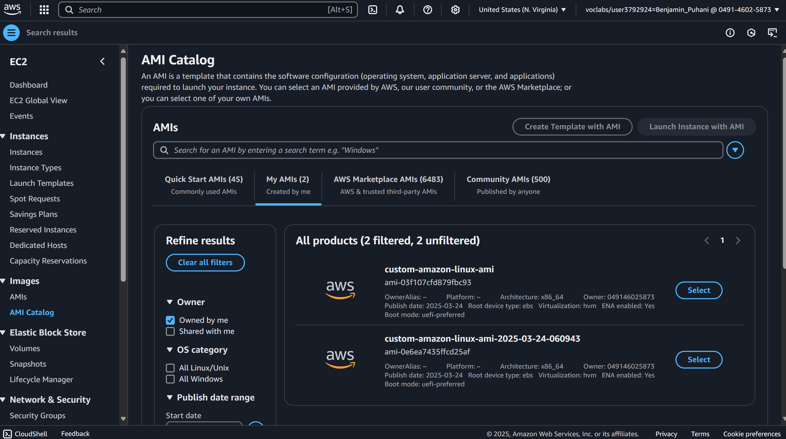
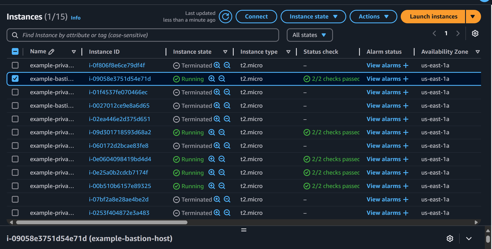
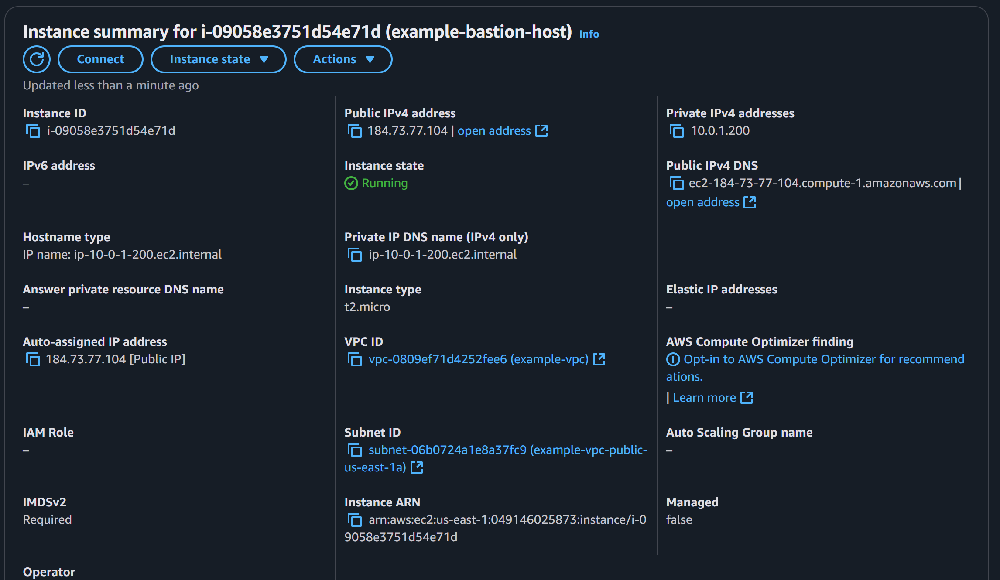
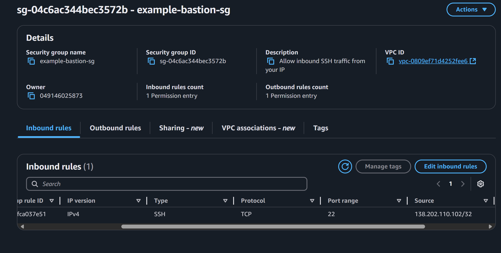
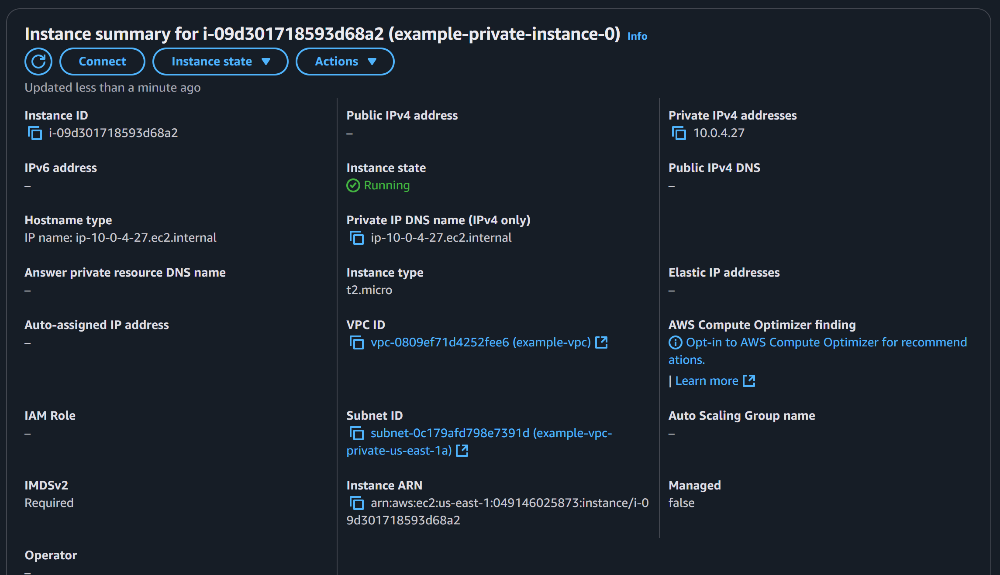
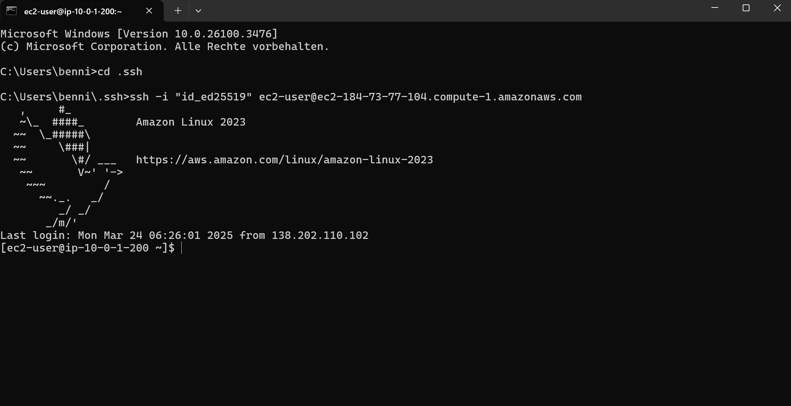

# Assignment #8 - Packer & Terraform
## CS-486 - DevOps

---
This repository is splint into two parts:

### Task A: Packer
#### Create a custom AWS AMI using Packer that contains the following:
- Amazon Linux 
- Docker 
- Your SSH public key is set so you can log in using your private key

### Task B: Terraform
#### Create Terraform scripts to provision AWS resources:
- VPC, private subnets, public subnets, all necessary routes (use modules)
- 1 bastion host in the public subnet (accept only your IP on port 22)
- 6 EC2 instances in the private subnet using your new AMI created from Packer

---

## Prerequisites:
- AWS Account
- Packer installed ([Install Instructions](https://developer.hashicorp.com/packer/install))
- Terraform installed ([Install Instructions](https://developer.hashicorp.com/terraform/install))

## Instructions to Run:

### Task A: Packer
Run the following commands to create a custom AWS AMI using Packer:
1. `cd packer` to navigate to the packer directory
2. Copy the `variables.pkr.hcl.example` file to `variables.pkr.hcl` and fill in the required variables
3. Run `packer init .` to initialize the packer template
4. Run `packer validate .` to validate the packer template
5. Run `packer build .` to build the AMI

#### Expected Results:
- A new AMI will be created in your AWS account

- View: [Log Output](packer/expected_results/expected_packer_output.log)

### Task B: Terraform
Run the following commands to provision AWS resources using Terraform:
1. `cd terraform` to navigate to the terraform directory
   1. (If needed cd back to the root directory and then navigate to the terraform directory)
2. Copy the `terraform.tfvars.example` file to `terraform.tfvars` and fill in the required variables
3. Run `terraform init` to initialize the terraform modules
4. Run `terraform validate` to validate the terraform scripts
5. Run `terraform plan` to create and view the execution plan
6. Run `terraform apply` to apply the changes and provision the resources

#### Expected Results:
- VPC, private subnets, public subnets, all necessary routes will be created
- 6 EC2 instances in the private subnet using your new AMI created from Packer
- 
- 1 bastion host in the public subnet (accept only your IP on port 22)
- 
- 
- Private Instance Example: only private IP is accessible
- 
- SSH Connection to Bastion Host: `ssh -i <path_to_private_key> ec2-user@<bastion_public_ip>`
- 
- Terraform Output log:
- View: [Log Output](terraform/expected_results/terraform_output.log)
